[<p align="center"></p>](https://github.com/recraftrelic/recraft-react-native-dating-app)

<h1 align="center">Recraft React native Dating App</h1>

<p align="center">This dating app is a boilerplate for any react native developer who wants to build a dating app. The goal of this boilerplate is to provide a fully functional dating app which can be reused with very little to no modification.</p>


Documentation
=======

* [Installation](https://documentation.recraftrelic.com/datingapp/docs/Installation.html)
* [Run the Project in Development Mode](https://documentation.recraftrelic.com/datingapp/docs/Installation.html)
* [Folder Structure](https://documentation.recraftrelic.com/datingapp/docs/Folder_Structure/)
* [Constants](https://documentation.recraftrelic.com/datingapp/docs/Constants/)
* [Themes](https://documentation.recraftrelic.com/datingapp/docs/Themes/)
* [Languages](https://documentation.recraftrelic.com/datingapp/docs/Languages/)
* [Pages](https://documentation.recraftrelic.com/datingapp/docs/Pages/)
* [Available Hooks](https://documentation.recraftrelic.com/datingapp/docs/Hooks/)


iOS Demo
=======
<p align="center">
  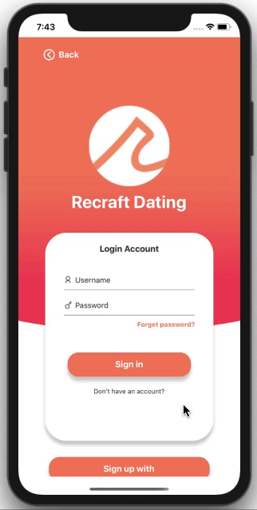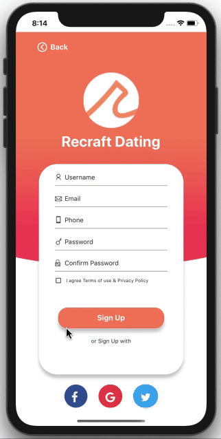
</p>
<p align="center">
  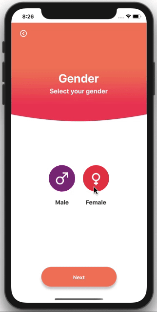
</p>
<p align="center">
  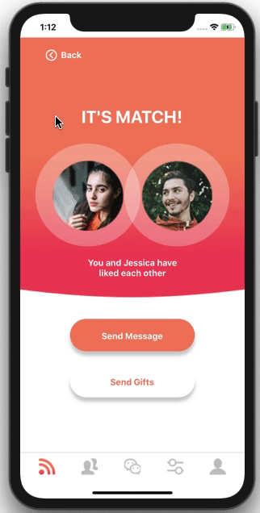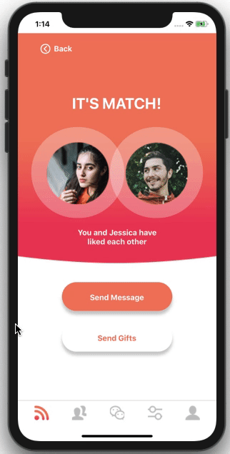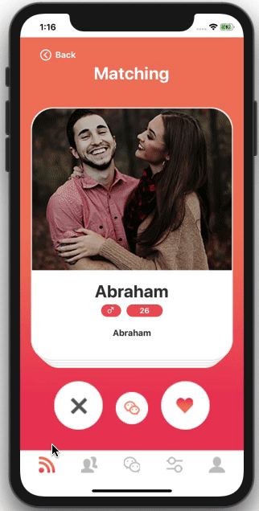
</p>
<p align="center">
  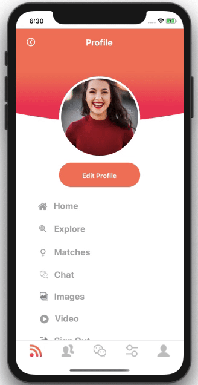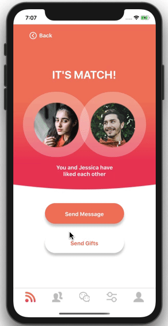
</p>
<p align="center">
  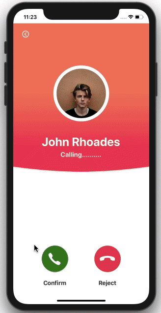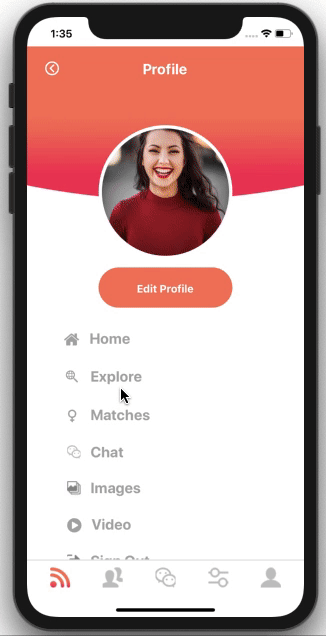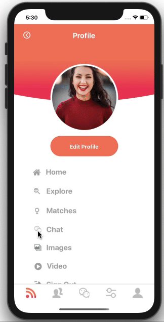
</p>
<p align="center">
  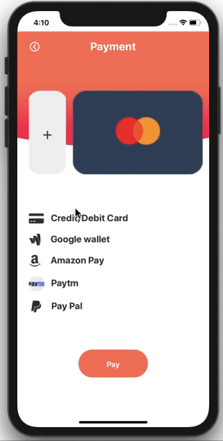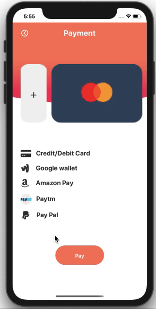
</p>

Android Demo
=======
<p align="center">
  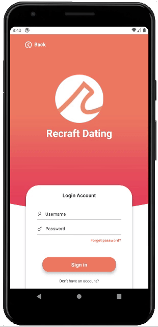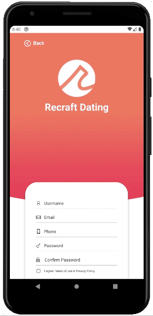
</p>
<p align="center">
  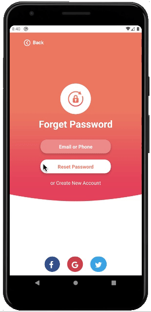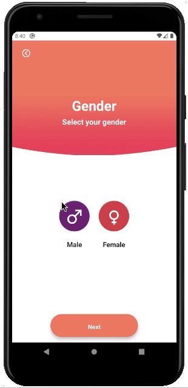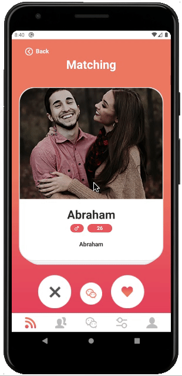
</p>
<p align="center">
  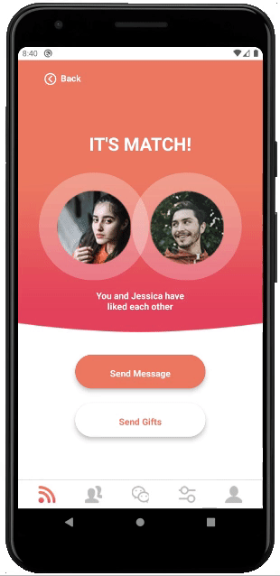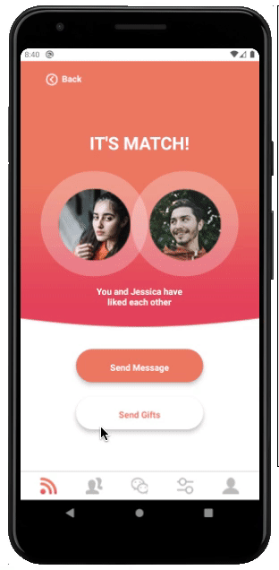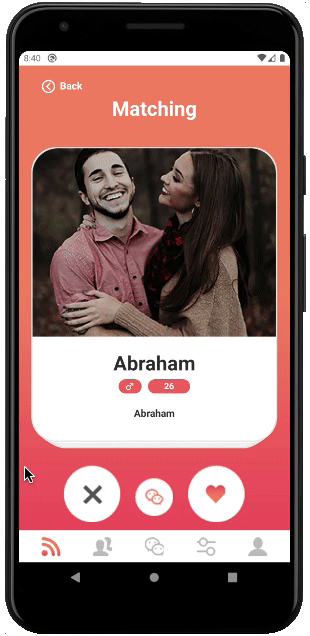
</p>
<p align="center">
  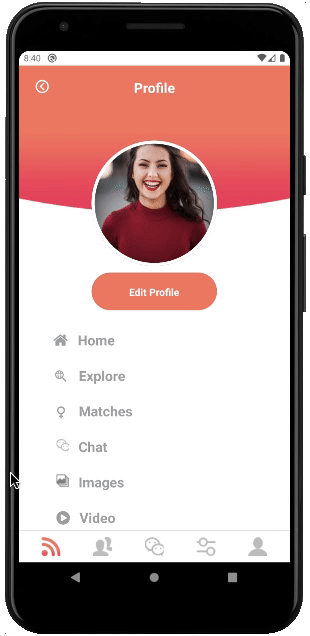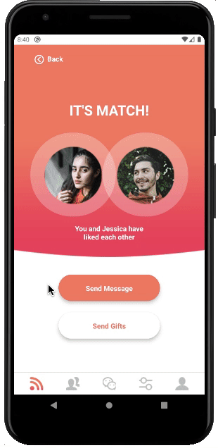
</p>
<p align="center">
  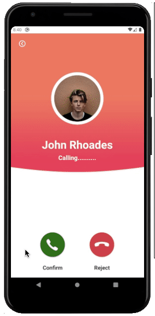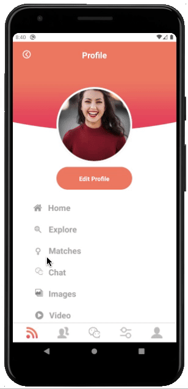
</p>
<p align="center">
  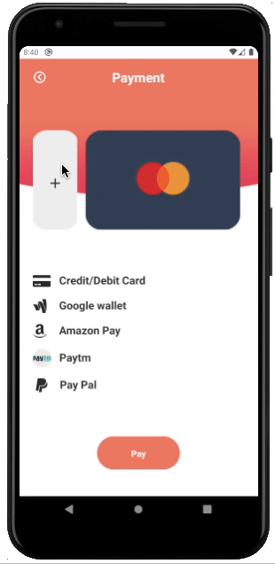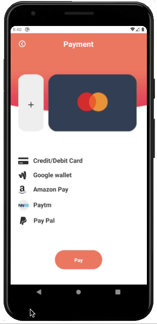
</p>


Packages & Libraries used
=======

* [React Native](https://www.npmjs.com/package/react-native) - A framework for building native apps with React.
* [React](https://www.npmjs.com/package/react) - A declarative, efficient, and flexible JavaScript library for building user interfaces.
* [React router native](https://www.npmjs.com/package/react-router-native) - Declarative routing for React.
* [TypeScript](https://www.npmjs.com/package/typescript) - TypeScript is a superset of JavaScript that compiles to clean JavaScript output.
* [React Vector Icons](https://www.npmjs.com/package/react-native-vector-icons) - Customizable Icons for React Native with support for NavBar/TabBar/ToolbarAndroid, image source and full styling.
* [React Native Deck Swiper](https://www.npmjs.com/package/react-native-deck-swiper) - Trigger swipe animations programmatically
* [React Native Picker Select](https://www.npmjs.com/package/react-native-picker-select) - A Picker component for React Native which emulates the native interfaces for iOS and Android
* [React Native Image Picker](https://www.npmjs.com/package/react-native-image-picker) - A React Native module that allows you to use native UI to select a photo/video from the device library or directly from the camera.

Steps to Run the Project in Development Mode
=======
Use the Below Commands to Clone the project and enter inside the Directory
After that Install the Dependencies.
```
git clone git@github.com:labaiv63/hybrid-dating-app-react-native.git
cd hybrid-dating-app-react-native
yarn install
```

### iOS
We can directly run the app
```
npx react-native run-ios
```

### Facing any error related to pods in ios
We need to install the pods
```
sudo gem install cocoapods
cd ios
pod install
cd ..
npx react-native run-ios
```

### Android
We can directly run the app
```
npx react-native run-android
```